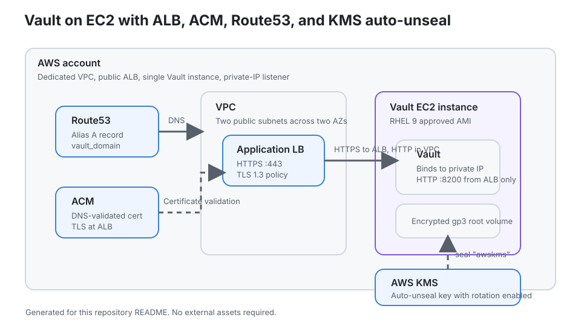

# Vault on EC2

**Single-node HashiCorp Vault on AWS EC2, fronted by an Application Load Balancer with ACM-managed TLS and AWS KMS auto-unseal.**




## At a Glance

| | |
|---|---|
| **Workspace** | `security-vault-dev` (HCP Terraform) |
| **AWS Provider** | `hashicorp/aws = 6.54.0` |
| **Terraform** | `>= 1.9.0` |
| **Vault editions** | `enterprise`, `community` |
| **Required inputs** | `allowed_cidr_blocks`, `ami_owner_account_id`, `existing_key_pair_name`, `project_name`, `route53_zone_name`, `vault_domain` |
| **What it creates** | VPC, ALB, ACM cert, Route53 records, KMS key, IAM role, EC2 instance |

## Quick Start

> [!IMPORTANT]
> Set the required workspace variables in HCP Terraform before triggering a run. See the [Inputs](#inputs) section.

### 1. Set workspace variables

In the `security-vault-dev` HCP Terraform workspace (or an attached variable set), set at minimum:

```
allowed_cidr_blocks    = ["x.x.x.x/32"]   # HCL type
ami_owner_account_id   = "123456789012"
existing_key_pair_name = "your-keypair"
project_name           = "vault-ec2"
route53_zone_name      = "example.com"
vault_domain           = "vault.example.com"
```

> [!IMPORTANT]
> All variables must be set as **terraform** category, not `env`. `allowed_cidr_blocks` must use **HCL** type. `vault_enterprise_license` must be marked **sensitive**.

### 2. Trigger a run

Push to `main` or trigger a run manually in HCP Terraform. The workspace is connected to this repository via VCS.

### 3. Initialize Vault (first deploy only)

After apply completes, Vault is running but **not yet initialized** — this is expected. The ALB will return 502 until initialization is complete. Run the helper script from your local machine:

```bash
./scripts/init-vault.sh
```

This connects to the instance over SSH, runs `vault operator init`, and writes the output to `.secrets/`. KMS auto-unseal kicks in immediately after init — no manual unseal keys required.

If the script can't find the key file (default is `linux.pem` in the current directory), override the SSH command directly:

```bash
VAULT_SSH_COMMAND="ssh -i /path/to/key.pem ec2-user@<public-dns>" ./scripts/init-vault.sh
```

### 4. Export a shell environment

```bash
eval "$(./scripts/vault-env.sh)"
vault status
vault secrets list
```

## Features

- Dedicated VPC with two public subnets across two AZs
- Public HTTPS endpoint via ACM-managed TLS on the ALB (TLS 1.3 policy)
- DNS automation — ACM validation and alias record created automatically in Route53
- Vault bound to the instance private IP only — never directly exposed to the internet
- AWS KMS auto-unseal with key rotation enabled (Enterprise)
- EC2 instance: approved RHEL 9 AMI, IMDSv2 required, encrypted `gp3` root volume
- IAM role scoped to the KMS unseal key only
- Supports both Vault Enterprise (Raft storage, KMS unseal) and Community (file storage)

## Architecture

```
Client → Route53 → ALB (HTTPS/TLS 1.3) → EC2 private IP (HTTP)
                                              ↓
                                         AWS KMS (auto-unseal)
```

1. Client connects to `https://vault_domain`
2. Route53 resolves to the ALB via alias A record
3. ALB terminates TLS using the ACM certificate
4. ALB forwards to Vault over HTTP on `vault_listener_port` inside the VPC
5. Vault uses AWS KMS for auto-unseal (Enterprise only)

## Inputs

All inputs are declared in [`variables.tf`](variables.tf).

### Required

| Name | Description | Type |
|---|---|---|
| `allowed_cidr_blocks` | CIDRs allowed to SSH to the instance | `list(string)` |
| `ami_owner_account_id` | AWS account ID that owns the approved base AMI | `string` |
| `existing_key_pair_name` | Existing EC2 key pair name | `string` |
| `project_name` | Naming prefix for all AWS resources (`[a-z0-9-]+`) | `string` |
| `route53_zone_name` | Public Route53 hosted zone containing `vault_domain` | `string` |
| `vault_domain` | Fully qualified domain name for the Vault endpoint | `string` |

### Optional

| Name | Default | Description |
|---|---|---|
| `ami_name_pattern` | `hc-base-rhel-9-x86_64-*` | AMI name glob; `most_recent = true` picks the newest match |
| `aws_region` | `us-east-1` | AWS region for all resources |
| `environment` | `dev` | One of `dev`, `staging`, `prod`, `sandbox` |
| `instance_type` | `t3.small` | EC2 instance type |
| `root_volume_size` | `20` | Root EBS volume size in GiB |
| `ssh_private_key_path` | `linux.pem` | Local path used by `vault_ssh_command` output |
| `vault_edition` | `enterprise` | `enterprise` or `community` |
| `vault_enterprise_license` | `null` | **Sensitive.** Enterprise license string |
| `vault_enterprise_version` | `2.0.3+ent` | Enterprise RPM version |
| `vault_listener_port` | `8200` | Vault listener port |
| `vault_version` | `1.21.4` | Community RPM version |
| `vpc_cidr` | `10.42.0.0/16` | VPC CIDR block |

## Outputs

| Name | Description |
|---|---|
| `ami_id` | AMI selected for the EC2 instance |
| `vault_alb_dns_name` | Native AWS DNS name of the ALB |
| `vault_private_ip` | Private IP of the Vault EC2 instance |
| `vault_public_ip` | Public IP of the Vault EC2 instance |
| `vault_url` | Public Vault URL (`https://vault_domain`) |
| `vault_ssh_command` | Example SSH command using `ssh_private_key_path` |
| `vpc_id` | ID of the dedicated VPC |

## Vault Edition Behaviour

| Edition | Package | Version variable | Storage | Auto-unseal |
|---|---|---|---|---|
| `enterprise` | `vault-enterprise` | `vault_enterprise_version` | Raft | AWS KMS |
| `community` | `vault` | `vault_version` | File | Manual |

> [!WARNING]
> Community edition uses file storage and requires manual unseal after every restart. It is suitable for dev/test only.

## Vault Operations

### Why initialization is a two-step process

Terraform starts Vault but deliberately does not initialize it. This keeps the root token and recovery keys off the instance, out of cloud-init logs, and under operator control. With KMS auto-unseal, all future unseals are automatic — the only manual step is the first `vault operator init`.

### Initialize (first time)

```bash
./scripts/init-vault.sh
```

- Reads `vault_ssh_command` from Terraform output (override with `VAULT_SSH_COMMAND` env var if needed)
- Checks whether Vault is already initialized — safe to re-run
- Runs `vault operator init -format=json` only when needed
- Writes output to `.secrets/<workspace>-<vault-domain>-vault-init.json` (`chmod 600`)
- After init, KMS unseals automatically — `vault status` will show `Sealed: false`

> [!IMPORTANT]
> Move the init output to an approved secret manager immediately. Do not leave it on your workstation.

### Export shell environment

```bash
eval "$(./scripts/vault-env.sh)"
```

Populates `VAULT_ADDR` and `VAULT_TOKEN` from the init output file.

### Manual fallback

```bash
export VAULT_ADDR="http://$(curl -sf http://169.254.169.254/latest/meta-data/local-ipv4):8200"
vault operator init
```

### Verify on instance

```bash
sudo systemctl status vault
sudo tail -n 100 /var/log/vault-bootstrap.log
vault status
```

## Security Posture

| Control | Implementation |
|---|---|
| Public TLS | ACM certificate on the ALB; TLS 1.3 policy (`ELBSecurityPolicy-TLS13-1-2-2021-06`) |
| No direct public listener | Vault binds to the instance private IP only |
| Restricted backend access | Vault listener port reachable only from the ALB security group |
| Secure metadata | IMDSv2 enforced (`http_tokens = required`) |
| Encrypted storage | Root EBS volume encrypted, `gp3` |
| No hardcoded secrets | All sensitive values via HCP Terraform workspace variables |
| Auto-unseal | KMS key with rotation enabled; IAM role scoped to that key only |
| Minimal IAM | Instance role grants only `kms:DescribeKey`, `kms:Encrypt`, `kms:Decrypt`, `kms:GenerateDataKey` |

## What Terraform Creates

| Resource | Details |
|---|---|
| `aws_vpc` | Dedicated VPC (`vpc_cidr`) |
| `aws_internet_gateway` | Internet access for public subnets |
| `aws_subnet` (×2) | Public subnets in two AZs |
| `aws_route_table` | Default route to the internet gateway |
| `aws_security_group` (×2) | ALB SG (inbound 443) and Vault SG (from ALB only + SSH) |
| `aws_acm_certificate` | DNS-validated TLS certificate for `vault_domain` |
| `aws_route53_record` (×2) | ACM validation record + alias A record |
| `aws_lb` | Public Application Load Balancer |
| `aws_lb_target_group` | HTTP target group with `/v1/sys/health` health check |
| `aws_lb_listener` | HTTPS listener with TLS 1.3 policy |
| `aws_kms_key` + `aws_kms_alias` | Auto-unseal key with rotation enabled |
| `aws_iam_role` + policy + profile | EC2 instance role scoped to the KMS key |
| `aws_instance` | RHEL 9, IMDSv2, encrypted root volume, fixed private IP |

## HCP Terraform

This configuration runs inside HCP Terraform. The `security-vault-dev` workspace is connected to this repository via VCS and triggers plans on every push to `main`.

- Set required variables in the workspace or an attached variable set
- Mark `vault_enterprise_license` as **sensitive**
- Use dynamic AWS credentials instead of long-lived access keys

## Repository Automation

| File | Purpose |
|---|---|
| [`.github/workflows/terraform.yml`](.github/workflows/terraform.yml) | `fmt` check + `validate` on every PR and push |
| [`.github/dependabot.yml`](.github/dependabot.yml) | Weekly updates for GitHub Actions and Terraform provider |
| [`SECURITY.md`](SECURITY.md) | Repository security guidance |
| [`.gitignore`](.gitignore) | Ignores state, plans, tfvars, and local secrets |
| [`.bob/skills/`](.bob/skills/) | HashiCorp agent skills for Terraform and Packer |

## Known Limitations

| Limitation | Notes |
|---|---|
| Single Vault node | Not an HA deployment |
| Enterprise: single-node Raft | Good for demos; not resilient across instance loss |
| Community: file storage | Dev/test only |
| Route53 zone must be in same account | Cross-account DNS not implemented |
| ALB backend is HTTP | TLS terminated at ALB; backend traffic stays inside the VPC |

## License

Business Source License 1.1 — see [`LICENSE`](LICENSE) if present, otherwise all rights reserved.
